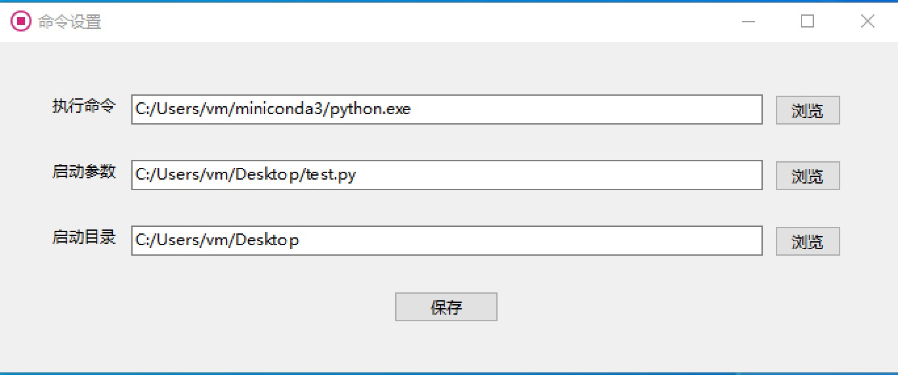

# 一个简单的exe调用其他命令的工具（基于QT 6.4开发）

## 软件设置界面

## 说明
* 第一次启动（ runcmd.exe 同目录下如果没有config.ini配置文件）会启动一个设置命令的界面，设置好命令之后，点保存会把命令设置保存到 runcmd.exe 同目录名称为 config.ini 的文件。
* 设置好之后，双击 runcmd.exe 或者快捷方式则会直接按照 config.ini 的设置执行命令。
* 然后可以生成个快捷方式到桌面，或者固定到任务栏，则可快速执行某个命令，比如杀掉某些进程。